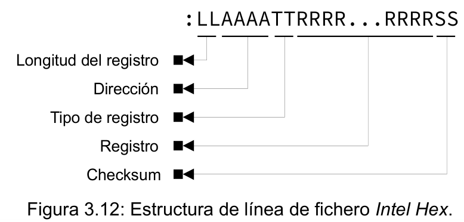
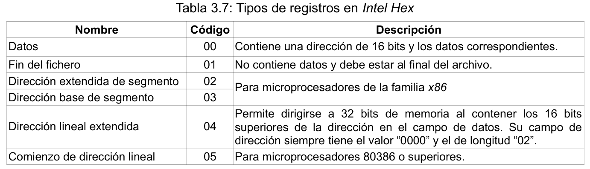

# IntelHex_qt

Intel Hex es un formato de archivo para la programación de microcontroladores, memorias y otros circuitos integrados. Consiste en un archivo de texto cuyas líneas contienen caracteres hexadecimales que codifican los datos, y su dirección de memoria. Cada línea del fichero comienza con el caracter ‘:’, seguido de dos dígitos hexadecimales que indican el tamaño del campo de datos (longitud del registro). Posteriormente, le sigue un campo formado por cuatro dígitos hexadecimales (2 bytes) en formato big-endian, con la dirección base del registro. El siguiente campo contiene dos dígitos hexadecimales (de 00 a 05) que definen el tipo de registro. El registro o campo de datos se compone por duplas de dígitos  hexadecimales en formato big-endian. Por último se encuentra un campo de verificación (Checksum) de dos dígitos hexadecimales, que contiene el complemento a dos de la suma de todos los campos anteriores, salvo el caracter de inicio. La Figura 3.12 muestra la estructura anteriormente descrita.

La Tabla 3.7 muestra los tipos de registros definidos en el formato Intel Hex. Algunos de estos tipos de registros no se utilizan en los ficheros “.hex” que devuelve el compilador XC8, porque su uso no tienen ningún sentido en los microcontroladores PIC, ya que el formato Intel Hex fue desarrollado en sus inicios para los microprocesadores de Intel®.

En el bootloader [FreeBottloader_PIC18F](https://github.com/dezamora98/Free_bootloader_PIC18F.git) el host es el encargado de conformar los paquetes a enviar al AutoUSB-KIT v6 y de asegurar que las direcciones de cada paquete sean compatibles. Para lograr esto se implementa la clase hexcode, que realiza la función de intérprete de ficheros Intel Hex, para generar la lista de paquetes a enviar en el proceso de escritura del AutoUSB-KIT v6. Esta clase recibe en su constructor la dirección de inicio y fin de la memoria asignada para la aplicación de usuario (en este caso de 0x0000 a 0x67FF) y la dirección del vector de aplicación (0x6800). La Figura 3.13 muestra un diagrama de clases del intérprete de ficheros Intel Hex, donde se puede apreciar la dependencia de otras tres clases (Intel_line, code_packs y pack_32).

____

<dezamora98@gmail.com>
